# OPNManager

OPNManager is a streamlined, user-friendly application designed to simplify the management of OPNsense firewalls. Built with Tauri and SvelteKit, this cross-platform app provides an intuitive interface for users who need a more simplified alternative to the standard OPNsense web interface.

## Disclaimer

**OPNManager is an independent project and is not affiliated with or endorsed by the OPNsense project or its developers.** This application is provided "as-is" without any warranties or guarantees. Users should exercise caution and ensure they understand the risks associated with granting API access

## Support the Project

If you find this application useful, consider supporting its development or downloading it from the official app stores.

  
  &nbsp;&nbsp;
  
    
  

## Features

- **Updates**: Check for updates, read change log and update firewall.
- **Dashboard**: Get a quick overview of your OPNsense system's status, including gateway information and service status.
- **Device Management**: View devices on your network, including the ability to flush the ARP table.
- **Firewall Rules**: Enable and disable firewall rules created with the firewall automation plugin.
    - https://docs.opnsense.org/development/api/core/firewall.html
- **Alias Management**: Easily view, add, and remove IP addresses from firewall aliases.
- **Simple Settings**: Configure API access and update security PIN with a straightforward interface.
- **Multiple Firewall management**: Add multiple Firewall profiles and IP addresses
- **Dark Mode**: Add dark/light mode theme switch to top Navbar

## Purpose

This application is tailored for clients who require a simplified interface for managing their OPNsense firewall. It provides essential functionality for immediate actions while maintaining a balance between usability and security. For more complex configuration changes, users are encouraged to use the OPNsense webUI.

## Getting Started

1. Download the appropriate version for your operating system from the releases page.
2. Install the application on your device.
3. On first run, you'll be prompted to enter your OPNsense API credentials and create a security PIN.
4. Once set up, you can log in and start managing your OPNsense firewall.

## Security Note

**WARNING:** Never share your API keys with anyone.

This application uses API access to interact with your OPNsense firewall. Ensure that you're using a dedicated API key with appropriate permissions.

## Feedback and Contributions

Your feedback and contributions are welcome! Please open an issue or submit a pull request on our GitHub repository.

---

## Screenshot Gallery  

Below are screenshots showcasing OPNManager's interface and features:  

  
  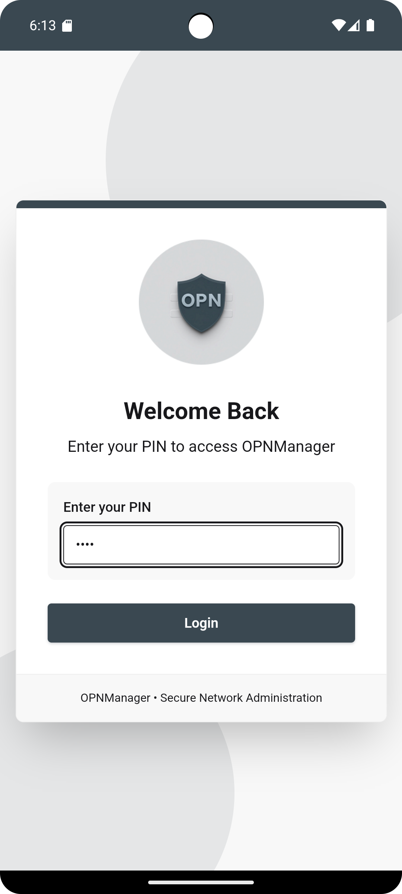  
  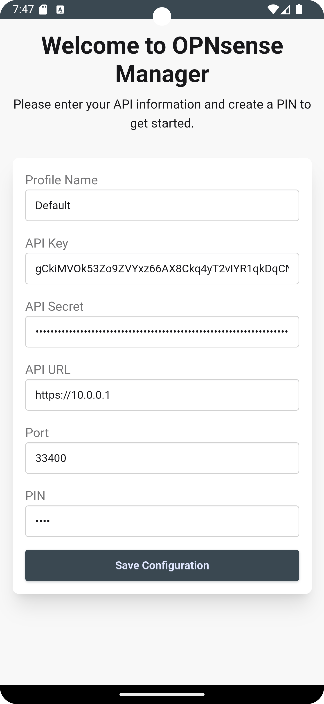  
  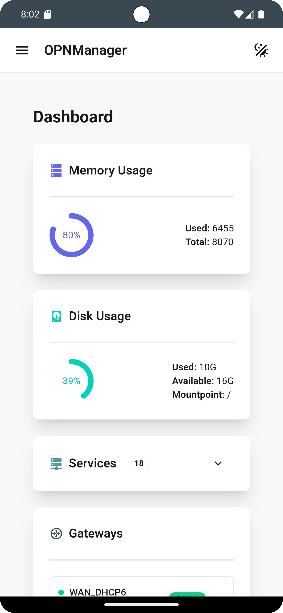  
  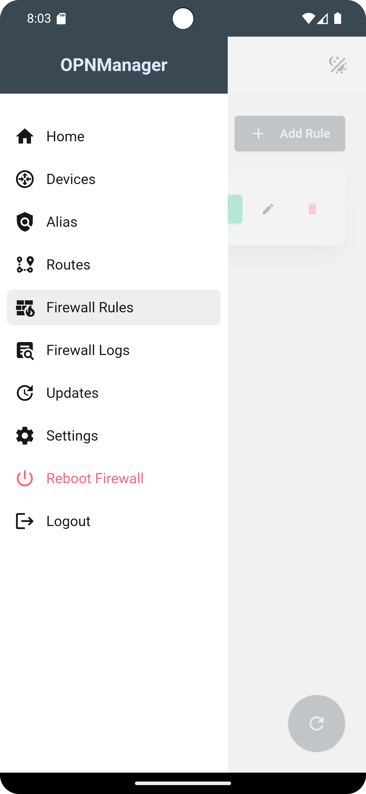  
  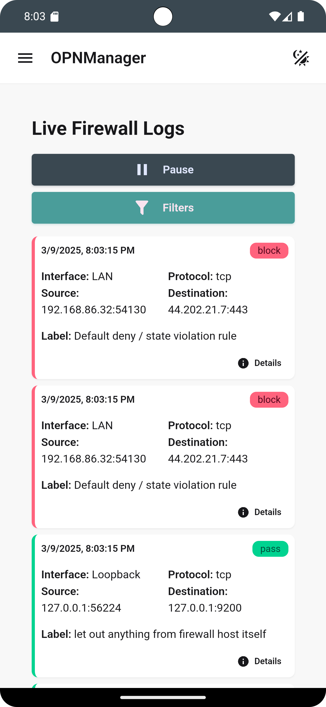  
  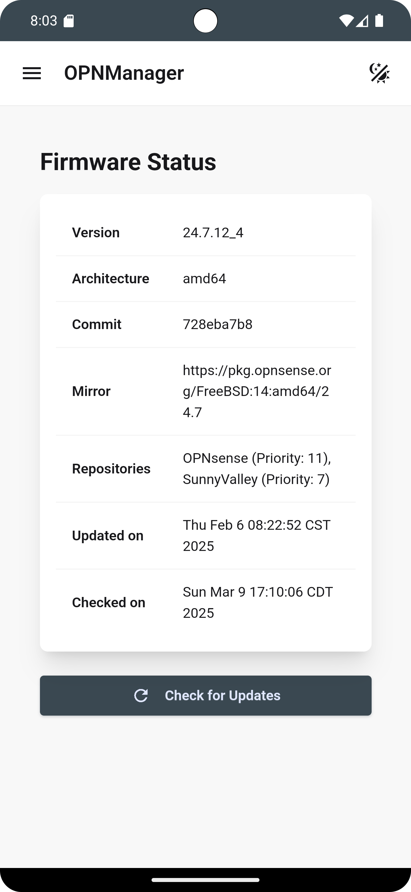  
  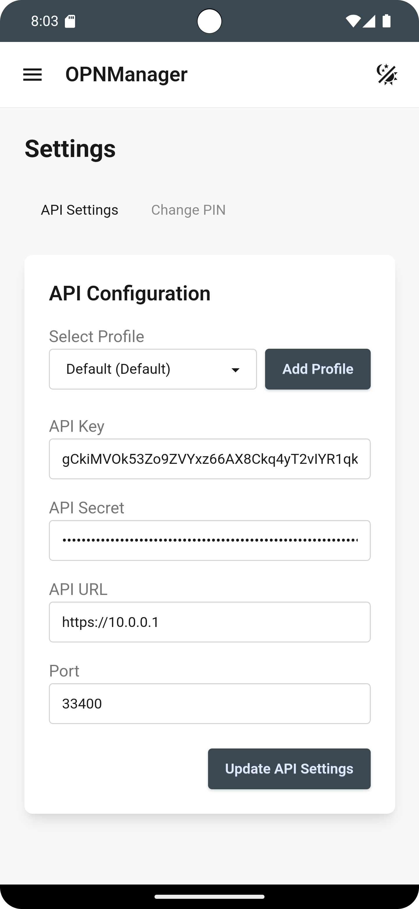  
  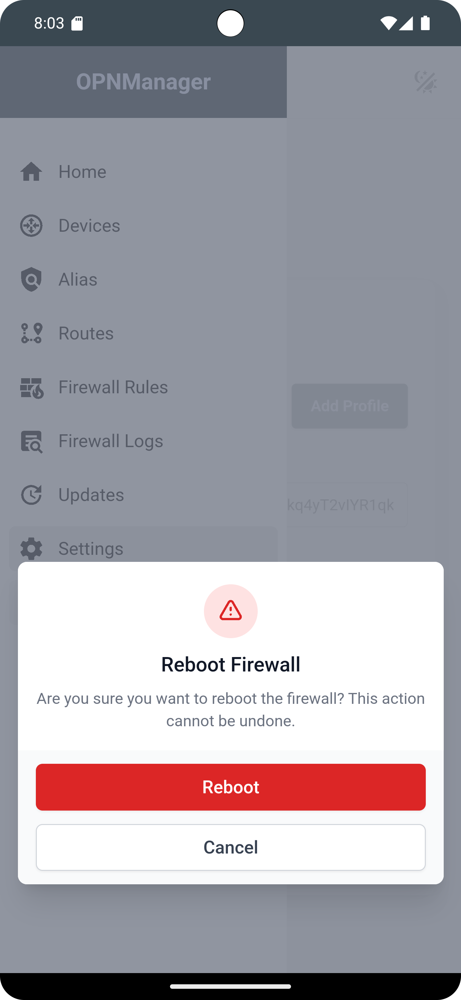  
  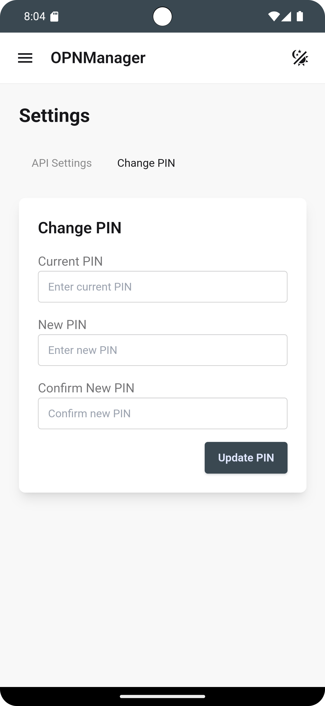  
  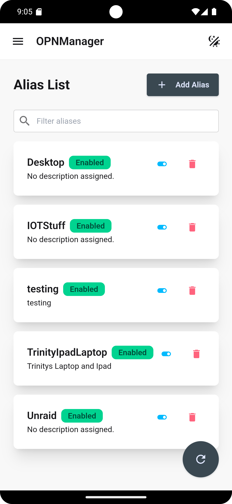  
  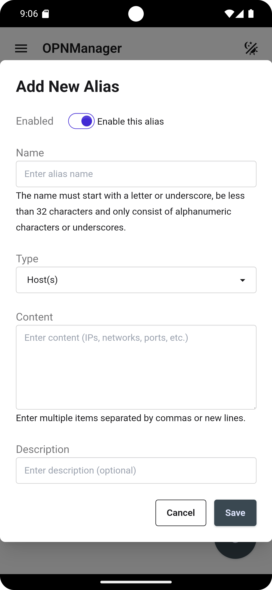  
  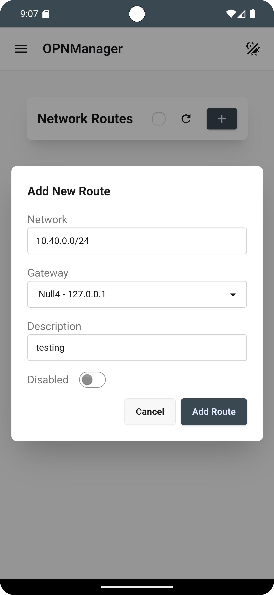  
  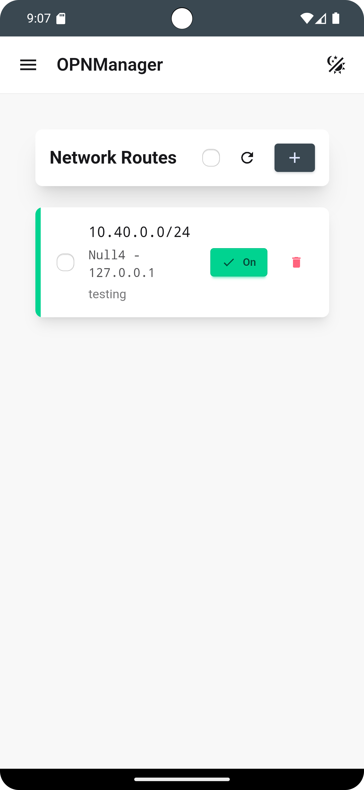  
    
  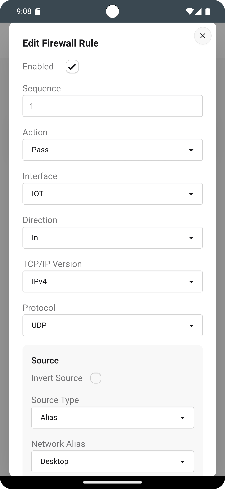  
  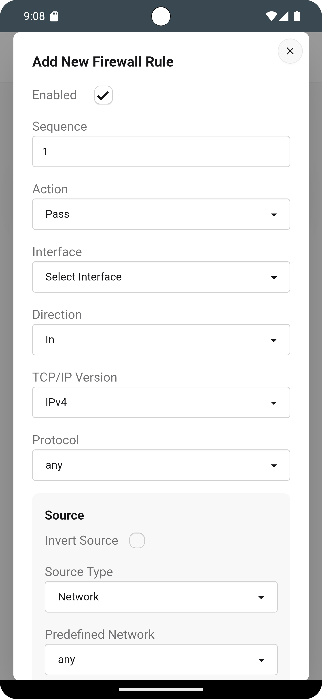  
  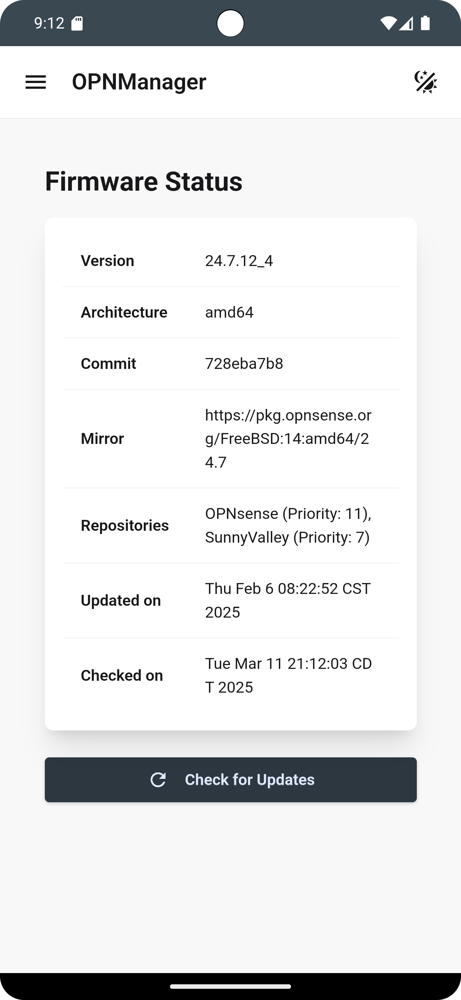  

  
